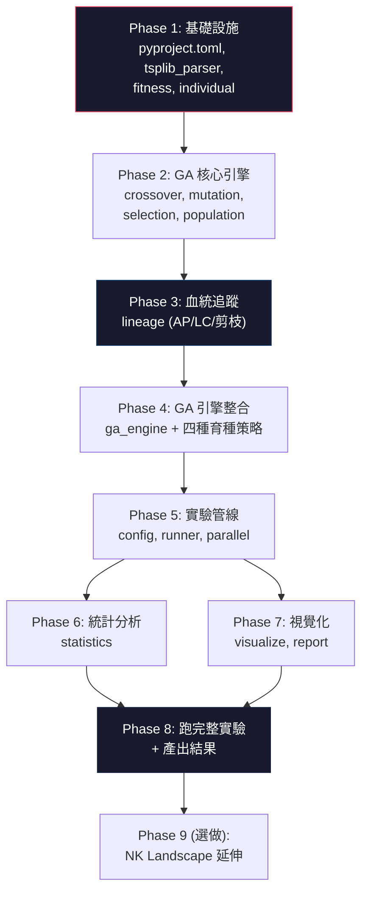

# 基因演算法「血統濃度」與子代品質相關性研究 — 實作計畫

## 目標概述

根據[實驗設計書](file:///c:/Users/s06t0/Desktop/驗血基因演算法/血統濃度與GA子代品質_實驗設計書.md)，實作一套完整的研究系統，包含：
1. 支援 TSP 的基因演算法引擎（路徑編碼、OX/PMX 交叉、Swap 突變）
2. 血統追蹤模組（AP 字典、LC 計算、始祖剪枝機制）
3. 四種育種策略（精英 / 標準 GA / 劣質 / 隨機交配）
4. 實驗執行管線（30 runs × 4 策略 × 多個 TSP 實例）
5. 統計分析與視覺化

**技術棧：Python 3.11+**，純 CPU 計算（GA 本身為離散組合最佳化，GPU 加速無顯著效益）。

**硬體：** i7-8750H（6C/12T）+ GTX 1660Ti（本專案不使用 GPU）+ 預估所需記憶體 ≤ 4 GB

---

## User Review Required

> [!IMPORTANT]
> **程式語言選擇**：本計畫預設使用 **Python**，因其生態系（NumPy、SciPy、Matplotlib、Seaborn）最適合研究型專案的快速迭代與統計分析。若您偏好其他語言（如 C++/Rust 效能優先），請告知。

> [!IMPORTANT]
> **交叉運算子選擇**：設計書提到 OX 或 PMX。建議 **兩者都實作**，在初步實驗中比較後選定主力運算子。若您只想先實作一種，請指定。

> [!IMPORTANT]
> **延伸實驗（NK Landscape）**：設計書列為選做。建議先完成 TSP 主實驗後再評估。是否納入第一階段實作？

---

## Open Questions

1. **視覺化語言**：圖表標註是否要用中文？（學術論文通常使用英文）
2. **結果輸出格式**：是否需要自動產生 LaTeX 表格 / 論文用圖片？
3. **是否需要 Web UI**：是否需要一個互動式儀表板即時監控實驗進度，還是只需要命令列 + 產出報告即可？

---

## Proposed Changes

### 專案目錄結構

```
驗血基因演算法/
├── 血統濃度與GA子代品質_實驗設計書.md   # 已有
├── pyproject.toml                        # 專案設定與依賴管理
├── README.md                             # 專案說明
│
├── src/                                  # 核心程式碼
│   ├── __init__.py
│   ├── individual.py                     # 個體類別（基因、適應度、AP 字典、LC）
│   ├── population.py                     # 族群管理（初始化、菁英保留、多樣性計算）
│   ├── crossover.py                      # 交叉運算子（OX、PMX）
│   ├── mutation.py                       # 突變運算子（Swap mutation）
│   ├── selection.py                      # 選擇策略（Tournament、精英、劣質、隨機）
│   ├── fitness.py                        # 適應度函數（TSP 路徑長度）
│   ├── lineage.py                        # 血統追蹤模組（AP 計算、LC 計算、剪枝）
│   ├── ga_engine.py                      # GA 主迴圈引擎
│   └── tsplib_parser.py                  # TSPLIB 格式解析器
│
├── experiments/                          # 實驗執行
│   ├── __init__.py
│   ├── config.py                         # 實驗參數設定（dataclass）
│   ├── runner.py                         # 實驗執行器（單次 run + 批次管理）
│   └── parallel.py                       # 多進程並行執行（利用 12 執行緒）
│
├── analysis/                             # 統計分析與視覺化
│   ├── __init__.py
│   ├── statistics.py                     # 統計檢定（Pearson/Spearman、ANOVA、Tukey HSD）
│   ├── visualize.py                      # 視覺化（收斂曲線、LC 分布、桑基圖等）
│   └── report.py                         # 自動產生實驗報告
│
├── data/                                 # 資料目錄
│   ├── tsplib/                           # TSPLIB 測試實例（eil51.tsp, kroA100.tsp 等）
│   └── results/                          # 實驗結果輸出（CSV / JSON）
│
└── tests/                                # 單元測試
    ├── test_crossover.py                 # 交叉運算子正確性測試
    ├── test_lineage.py                   # 血統追蹤計算正確性測試
    ├── test_fitness.py                   # 適應度計算測試
    └── test_ga_engine.py                 # GA 引擎整合測試
```

---

### Component 1：個體與族群基礎

#### [NEW] [pyproject.toml](file:///c:/Users/s06t0/Desktop/驗血基因演算法/pyproject.toml)

專案依賴管理，使用 `pip install -e .` 安裝。核心依賴：

| 套件 | 用途 |
|---|---|
| `numpy` | 數值計算、陣列操作 |
| `scipy` | 統計檢定（ANOVA、Tukey HSD） |
| `matplotlib` | 基礎繪圖 |
| `seaborn` | 統計視覺化 |
| `plotly` | 互動式桑基圖 |
| `pandas` | 數據整理與匯出 |
| `tqdm` | 進度條 |
| `joblib` | 多進程並行 |

#### [NEW] [individual.py](file:///c:/Users/s06t0/Desktop/驗血基因演算法/src/individual.py)

```python
@dataclass
class Individual:
    id: int                          # 全域唯一 ID
    genes: np.ndarray                # 路徑（城市排列）
    fitness: float                   # 適應度（路徑總長度，越小越好）
    generation: int                  # 所屬世代
    parent_a_id: Optional[int]       # 父母 A（始祖為 None）
    parent_b_id: Optional[int]       # 父母 B（始祖為 None）
    ancestry: Dict[int, float]       # AP 字典 {founder_id: proportion}
    lc: float                        # 血統濃度
```

- 始祖個體：`ancestry = {self.id: 1.0}`
- 子代個體：由 `lineage.py` 計算 AP 後注入

#### [NEW] [population.py](file:///c:/Users/s06t0/Desktop/驗血基因演算法/src/population.py)

- `create_initial_population(n_cities, pop_size)` → 隨機排列產生始祖族群
- `calculate_diversity(population)` → 成對 edge-difference 多樣性
- `elitism(population, n_elite)` → 菁英保留機制
- 維護全域 ID 計數器確保每個個體 ID 唯一

---

### Component 2：GA 運算子

#### [NEW] [crossover.py](file:///c:/Users/s06t0/Desktop/驗血基因演算法/src/crossover.py)

實作兩種交叉運算子，均確保輸出合法排列：

**Order Crossover (OX)**：
1. 隨機選取子序列段 `[i, j]`
2. 子代保留父 A 的 `[i, j]` 片段
3. 其餘位置依父 B 的順序填入未出現的城市

**Partially Mapped Crossover (PMX)**：
1. 隨機選取映射段 `[i, j]`
2. 交換父 A、父 B 在映射段的基因
3. 利用映射關係解決衝突

兩者均附帶合法性檢查（assert 排列完整性）。

#### [NEW] [mutation.py](file:///c:/Users/s06t0/Desktop/驗血基因演算法/src/mutation.py)

**Swap Mutation**：以機率 `p_mutation` 隨機交換路徑中兩個城市的位置。

- 輸入：`Individual`、`p_mutation: float`
- 輸出：突變後的 `Individual`（原始不變，回傳新物件）

#### [NEW] [selection.py](file:///c:/Users/s06t0/Desktop/驗血基因演算法/src/selection.py)

統一介面 `select_parents(population, strategy, **kwargs) → (parent_a, parent_b)`

| 策略 | 實作方式 |
|---|---|
| `elite` | 從 fitness 排名 top 20% 中隨機抽兩個 |
| `tournament` | Tournament selection（k=3），標準 GA 基準組 |
| `poor` | 從 fitness 排名 bottom 20% 中隨機抽兩個 |
| `random` | 完全隨機抽取 |

#### [NEW] [fitness.py](file:///c:/Users/s06t0/Desktop/驗血基因演算法/src/fitness.py)

- `calculate_tour_length(genes, distance_matrix)` → 計算 TSP 路徑總長度
- 預先計算距離矩陣 `build_distance_matrix(cities)` 存為 NumPy 2D array，避免重複計算
- 適應度 = 路徑總長度（最小化問題）

---

### Component 3：血統追蹤模組（核心創新）

#### [NEW] [lineage.py](file:///c:/Users/s06t0/Desktop/驗血基因演算法/src/lineage.py)

此模組是整個研究的核心，實作設計書第 3 節的所有公式：

```python
class LineageTracker:
    def __init__(self, founder_qualities: Dict[int, float], prune_threshold: float = 0.001):
        """
        founder_qualities: {founder_id: q_f}，始祖品質分數
        prune_threshold: AP 低於此值的始祖會被剪枝
        """

    def compute_founder_quality(self, population: List[Individual]) -> Dict[int, float]:
        """
        依設計書 3.2 節公式：q_f = 1 - (rank(f) - 1) / (N - 1)
        rank 1 = 最佳個體 → q = 1.0
        """

    def compute_offspring_ancestry(self, parent_a: Individual, parent_b: Individual) -> Dict[int, float]:
        """
        設計書 3.1 節：p_child,f = 0.5 * p_a,f + 0.5 * p_b,f
        合併後執行剪枝（< threshold 的項目移除並重新正規化）
        """

    def compute_lc(self, ancestry: Dict[int, float]) -> float:
        """
        設計書 3.3 節：LC_i = Σ_f p_i,f × q_f
        """

    def compute_ancestry_entropy(self, ancestry: Dict[int, float]) -> float:
        """
        補充指標：Shannon entropy of AP，衡量血統多樣性
        H = -Σ_f p_i,f * log2(p_i,f)
        """

    def compute_effective_founders(self, ancestry: Dict[int, float]) -> float:
        """
        補充指標：有效始祖數 = 1 / Σ_f (p_i,f)²
        """
```

> [!IMPORTANT]
> **剪枝機制（效能關鍵）**：設計書 6.1 節提到，當 `p_i,f < 0.001` 時應捨去並重新正規化。以族群大小 200、300 代為例，不剪枝時每個個體的 AP 字典最多含 200 個 key（始祖數）；剪枝後預期穩定在 10-30 個 key，記憶體與計算效能差距約 10 倍。

**效能估算**（i7-8750H 單核）：
- AP 合併 + 剪枝：~1 μs / 個體（字典操作）
- LC 計算：~0.5 μs / 個體
- 每代 200 個體 × 300 代 = 60,000 次 → 總計 ~0.1 秒（可忽略）

---

### Component 4：GA 引擎

#### [NEW] [ga_engine.py](file:///c:/Users/s06t0/Desktop/驗血基因演算法/src/ga_engine.py)

GA 主迴圈，整合所有模組：

```python
class GAEngine:
    def __init__(self, config: ExperimentConfig):
        self.config = config
        self.lineage_tracker: LineageTracker
        self.history: List[GenerationRecord]  # 每代記錄

    def run(self, seed: int) -> ExperimentResult:
        """完整的一次 GA 運行"""
        # 1. 初始化族群（始祖）
        # 2. 計算始祖品質 q_f
        # 3. 主迴圈：
        #    a. 選擇親代（依育種策略）
        #    b. 交叉產生子代
        #    c. 計算子代 AP & LC（順手算，O(始祖數)）
        #    d. 突變
        #    e. 計算適應度
        #    f. 菁英保留
        #    g. 記錄本代數據
        # 4. 回傳完整實驗結果
```

**每代記錄的數據結構**（`GenerationRecord`）：

```python
@dataclass
class GenerationRecord:
    generation: int
    best_fitness: float
    avg_fitness: float
    worst_fitness: float
    diversity: float                          # 族群多樣性
    avg_lc: float                             # 平均血統濃度
    lc_fitness_correlation: float             # LC 與適應度的相關係數
    upset_offspring_rate: float               # 逆勢子代出現率
    individuals: List[IndividualSnapshot]     # 可選：完整個體快照（僅每 N 代存一次以節省空間）
```

---

### Component 5：TSPLIB 解析器

#### [NEW] [tsplib_parser.py](file:///c:/Users/s06t0/Desktop/驗血基因演算法/src/tsplib_parser.py)

解析 TSPLIB 標準格式（`.tsp` 檔案）：

- 支援 `EUC_2D`（歐幾里得距離）邊權重類型
- 解析城市座標 → `List[Tuple[float, float]]`
- 產生距離矩陣 → `np.ndarray`
- 支援解析最優解檔案（`.opt.tour`）以計算與已知最優解的差距

**需下載的測試實例**：
| 實例 | 城市數 | 已知最優解 |
|---|---|---|
| `eil51` | 51 | 426 |
| `kroA100` | 100 | 21282 |
| `pr1002`（選做） | 1002 | 259045 |

---

### Component 6：實驗執行管線

#### [NEW] [config.py](file:///c:/Users/s06t0/Desktop/驗血基因演算法/experiments/config.py)

```python
@dataclass
class ExperimentConfig:
    # TSP 實例
    tsp_instance: str            # "eil51" / "kroA100"
    optimal_tour_length: float   # 已知最優解

    # GA 參數
    population_size: int = 200
    n_generations: int = 300
    crossover_type: str = "OX"   # "OX" / "PMX"
    mutation_rate: float = 0.02
    n_elites: int = 2
    tournament_size: int = 3

    # 育種策略
    breeding_strategy: str = "tournament"  # "elite" / "tournament" / "poor" / "random"
    elite_ratio: float = 0.2              # 精英/劣質組的篩選比例

    # 血統追蹤
    ancestry_prune_threshold: float = 0.001

    # 實驗控制
    n_runs: int = 30             # 每組重複次數
    random_seed: int = 42        # 基礎隨機種子
```

#### [NEW] [runner.py](file:///c:/Users/s06t0/Desktop/驗血基因演算法/experiments/runner.py)

- `run_single(config, seed)` → 單次實驗
- `run_batch(config, seeds)` → 批次 30 次實驗
- 結果自動存為 CSV/JSON 至 `data/results/`

#### [NEW] [parallel.py](file:///c:/Users/s06t0/Desktop/驗血基因演算法/experiments/parallel.py)

利用 `joblib.Parallel` 進行多進程並行：

```python
# i7-8750H: 6 核 12 緒
# 建議使用 n_jobs=10（留 2 緒給系統）
results = Parallel(n_jobs=10)(
    delayed(run_single)(config, seed) 
    for seed in range(30)
)
```

**效能預估**（i7-8750H，單核）：

| TSP 實例 | 單次 run 預估時間 | 30 runs × 4 策略（10 並行） |
|---|---|---|
| `eil51` (51 城市) | ~15-25 秒 | ~2-3 分鐘 |
| `kroA100` (100 城市) | ~60-90 秒 | ~8-12 分鐘 |
| `pr1002` (1002 城市) | ~30-60 分鐘 | ~6-12 小時 |

> [!NOTE]
> 瓶頸在適應度計算（距離矩陣查表）與交叉運算子，血統追蹤的開銷相對可忽略。`eil51` + `kroA100` 的完整實驗預估在 **15-20 分鐘內可完成**，非常適合快速迭代。

---

### Component 7：統計分析

#### [NEW] [statistics.py](file:///c:/Users/s06t0/Desktop/驗血基因演算法/analysis/statistics.py)

對應設計書 4.5 節的三項統計方法：

**1. 相關分析（對應 H1）**
```python
def lc_fitness_correlation(data: pd.DataFrame) -> CorrelationResult:
    """
    計算 LC 與個體適應度的 Pearson & Spearman 相關係數
    - 全資料合併（跨組別、跨世代）
    - 依世代分層計算趨勢
    - 回傳 r 值、p 值、95% CI
    """
```

**2. 群組比較（對應 H2、H3）**
```python
def compare_strategies(results: Dict[str, List[float]]) -> ANOVAResult:
    """
    One-way ANOVA + Tukey HSD post-hoc 比較
    - 依變項：各組最終代最佳解品質（與最優解的差距百分比）
    - 報告 F 值、p 值、η²（效果量）
    """
```

**3. 逆勢子代分析（對應 H3）**
```python
def upset_offspring_analysis(data: pd.DataFrame) -> pd.DataFrame:
    """
    計算各組「子代適應度優於雙親平均」的出現率
    依組別與世代分層統計
    """
```

---

### Component 8：視覺化

#### [NEW] [visualize.py](file:///c:/Users/s06t0/Desktop/驗血基因演算法/analysis/visualize.py)

產出以下圖表（均存為 PNG 300 DPI + 互動式 HTML）：

| 圖表 | 說明 | 對應假設 |
|---|---|---|
| **收斂曲線** | 四策略的每代最佳/平均適應度（含 30 runs 的 mean ± std 帶狀圖） | H2 |
| **LC 分布演化圖** | 每代 LC 的箱型圖 / 小提琴圖，四策略並列 | H1、H2 |
| **LC vs. Fitness 散點圖** | 散點 + 回歸線 + 相關係數標註 | H1 |
| **族群多樣性曲線** | 每代 edge-difference 多樣性，觀察精英組多樣性流失速度 | H2 |
| **桑基圖** | 始祖血統佔比隨世代的消長（Plotly 互動式） | 視覺化亮點 |
| **逆勢子代率曲線** | 各策略每代的逆勢子代出現率 | H3 |
| **有效始祖數曲線** | 每代平均有效始祖數，觀察血統瓶頸效應 | 補充 |
| **熱力圖** | 始祖品質 × 始祖貢獻比例的 2D 分布 | 補充 |

---

### Component 9：延伸實驗（選做）

若時間允許，在 `src/` 下新增：

#### [NEW] [nk_landscape.py](file:///c:/Users/s06t0/Desktop/驗血基因演算法/src/nk_landscape.py)

- NK Landscape 問題產生器（可調 N 和 K）
- K=0 → 無 epistasis（線性可分解）
- K=N-1 → 最大 epistasis（完全隨機地景）
- 適應度函數整合至 `GAEngine`

#### [NEW] [trap_function.py](file:///c:/Users/s06t0/Desktop/驗血基因演算法/src/trap_function.py)

- Trap function 問題產生器
- 具有欺騙性的適應度地景，用於驗證 H1 的適用邊界

---

## 實作順序與依賴關係



---

## Verification Plan

### Automated Tests

```bash
# 在專案根目錄執行
python -m pytest tests/ -v --tb=short
```

| 測試項目 | 驗證內容 |
|---|---|
| `test_crossover.py` | OX/PMX 輸出皆為合法排列（無重複、無遺漏城市） |
| `test_lineage.py` | AP 合併後 Σ p_i,f = 1.0；LC 與設計書範例（§3.4）完全一致；剪枝後重新正規化正確 |
| `test_fitness.py` | 已知 TSP 實例的路徑長度計算正確（對照 TSPLIB 最優解） |
| `test_ga_engine.py` | GA 完整 run 不 crash；菁英保留確實保留最佳個體；標準 GA 在 eil51 上 30 次 run 平均差距 < 15% |

### Manual Verification

1. **桑基圖視覺檢查**：精英育種組的桑基圖應呈現明顯的「少數始祖佔據大多數血統」漏斗形態
2. **LC 趨勢合理性**：精英組 LC 應持續上升、劣質組應持續下降、隨機組應接近平均
3. **統計結果可重現性**：固定 seed=42 時，兩次執行的結果完全相同
4. **效能驗證**：`eil51` 單次 run ≤ 30 秒，完整實驗 ≤ 5 分鐘

### 關鍵正確性里程碑

- [ ] **里程碑 1**：標準 GA 在 eil51 上收斂至已知最優解 ±10% 以內
- [ ] **里程碑 2**：血統追蹤的設計書範例（§3.4）數值精確重現 `LC_X = 0.75`
- [ ] **里程碑 3**：四種育種策略的 LC 趨勢符合預期方向
- [ ] **里程碑 4**：30 runs × 4 策略 × eil51 完整實驗在 5 分鐘內完成
